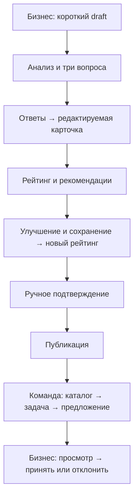
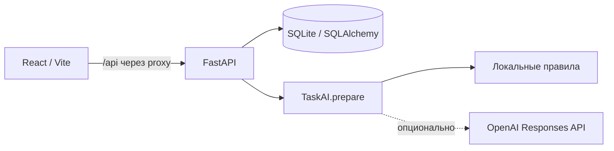

# Практика — Business × Students

## Краткое описание

«Практика» помогает бизнесу сформулировать задачу, а студенческим командам —
понять ожидаемый результат и предложить решение. Бизнес начинает с короткого
описания проблемы; система помогает уточнить требования и подготовить карточку
для каталога. Команда отвечает своим планом, а бизнес вручную выбирает исполнителя.

Проект решает проблему неполных постановок: из одной фразы часто непонятны
результат, доступные материалы и критерии успеха. Рейтинг показывает пробелы
в описании и помогает подготовить задачу к обсуждению с командой.

## Что реализовано

- Создание черновика из описания и необязательной темы задачи.
- Анализ исходных сведений и три уточняющих вопроса.
- Сборка редактируемой карточки из десяти полей с сохранением пользовательских ответов.
- Рейтинг готовности 0–100, разбивка по компонентам и рекомендации по заполнению.
- Ручное подтверждение карточки и отдельная публикация.
- Каталог с фильтрами темы и уровня готовности, сортировкой и пагинацией.
- Предложения команд: идея, план, оценка времени, контакт и необязательная ссылка
  на прототип; ручное принятие или отклонение бизнесом.
- Переключение демонстрационных ролей «Бизнес» и «Команда», локальное сохранение
  ввода форм и ссылок на созданные в браузере задачи.
- SQLite-хранилище, повторяемые демонстрационные данные, REST API и Swagger.
- Локальный анализ без ключа; опциональный адаптер внешнего AI с резервным режимом.

## Как работает решение

Бизнес вводит проблему, отвечает на вопросы и получает карточку с рейтингом.
После правок и подтверждения задача попадает в каталог. Студенты изучают её,
отправляют предложение, бизнес рассматривает его и принимает решение.
Результат сценария — опубликованная задача и сохранённое решение по предложению.



Задача: `draft → confirmed → published`. Подтверждение требует минимум трёх
сохранённых ответов; они могут быть явно пустыми. Правка сбрасывает подтверждение.
Публикация — отдельное действие. Опубликованную карточку редактировать нельзя.
Предложение: `pending → accepted / rejected`. Решение окончательное;
на задачу можно принять одну команду. Остальные предложения не отклоняются
автоматически, новые отклики после выбора команды по-прежнему разрешены.

### Формула рейтинга

`I(field) = 1`, если поле содержательно заполнено по правилам эвристики, иначе `0`.

```text
score = 10·I(context) + 10·I(need) + 20·I(data_materials)
      + 15·I(expected_result) + 15·I(success_criteria)
      + 10·I(constraints) + 10·I(users)
      +  5·I(contact) +  5·I(interaction_format)
```

| Компонент | Максимум |
| --- | ---: |
| Контекст + проблема | 20 (10 + 10) |
| Данные и материалы | 20 |
| Ожидаемый результат | 15 |
| Критерии успеха | 15 |
| Ограничения | 10 |
| Пользователи | 10 |
| Контакт + формат взаимодействия | 10 (5 + 5) |

| Баллы | Уровень API / UI |
| --- | --- |
| 0–39 | draft / Draft |
| 40–69 | workable / Workable |
| 70–89 | ready / Ready |
| 90–100 | priority / Priority |

Пустота, пунктуация и известные заглушки (`TBD`, `не знаю`, `нет данных` и др.)
дают 0. Полный список — в [SPEC](docs/SPEC.md). Название и тема баллов не дают;
исходное описание отдельно не оценивается. Рейтинг считает backend при создании,
ответах и сохранении правок. В редакторе до сохранения виден предыдущий рейтинг.
Это оценка заполненности, а не достоверности или качества решения.
`status=draft` и `rating.level=draft` — разные понятия.

### Правила каталога

Только `published`, включая задачи с 0 баллов. Низкий рейтинг не запрещает
публикацию или отклик. По умолчанию сортировка `rating_desc`; также есть
`rating_asc` и `newest`, при равенстве — `id DESC`.
Фильтры темы (точное совпадение после trim/casefold) и уровня применяются через AND.
Тему задаёт пользователь. API: `limit=50` по умолчанию, максимум 100; `offset=0`.
«Рабочие задачи» хранят ссылки на созданные в этом браузере задачи в localStorage.

## Технологии

| Часть решения | Технологии |
| --- | --- |
| Языки | Python, TypeScript, CSS, SQL |
| Интерфейс | React 19, React Router 7, Vite 7, Lucide, локальные шрифты Manrope |
| Backend и валидация | FastAPI, Pydantic 2, Uvicorn |
| Хранение | SQLite, синхронный SQLAlchemy 2 |
| HTTP и конфигурация | HTTPX, python-dotenv |
| AI по умолчанию | Локальные детерминированные правила, `AI_PROVIDER=mock` |
| Опциональный внешний AI | OpenAI Responses API, Structured Outputs; модель из `OPENAI_MODEL`, в коде по умолчанию `gpt-4o-mini` |
| Проверки | pytest, Playwright с Google Chrome, TypeScript compiler |

Зависимости backend зафиксированы в [requirements.txt](backend/requirements.txt),
frontend — в [package.json](frontend/package.json) и [package-lock.json](frontend/package-lock.json).

### AI-функция

`TaskAI.prepare` распределяет сведения по полям карточки и определяет приоритет
трёх уточняющих вопросов. `AI_PROVIDER=mock` — детерминированный локальный анализ:
явные метки вроде «Данные:» заполняют соответствующее поле, свободный текст
сохраняется в контексте. Интерфейс честно показывает «Базовый анализ».

Опциональный `AI_PROVIDER=openai` включает внешний адаптер. В корневом `.env`
задаются `OPENAI_API_KEY` и `OPENAI_MODEL` (по умолчанию `gpt-4o-mini`).
Настройки описывают реализованный адаптер; живой вызов с ключом в финальной
проверке не выполнялся. Ключ не должен попадать во frontend или сдаваемые файлы.

Внешняя модель выбирает только пары `field/source_id` из пользовательского ввода;
сервер проверяет ссылки и использует целые исходные фрагменты. Свободно дописывать
факты модель не может. Ответы и ручные правки сохраняются, неизвестное остаётся
пустым. Вопросы берутся из нейтральных шаблонов. При отсутствии ключа, timeout,
отказе или неверном ответе применяется локальный fallback; режим отражён в
`ai_analysis`. Запросы к модели идут при создании и ответах, не при чтении/правках.
Карточка всегда требует проверки и ручного подтверждения бизнеса.

## Архитектура проекта

На каждый HTTP-запрос создаётся SQLAlchemy-сессия. AI-модуль встроен в backend;
отдельных сервисов, очередей и автоматического назначения команд нет.



```text
backend/
  main.py              точка входа Uvicorn
  app/                 маршруты, модели, схемы, рейтинг, доступ к БД
    ai/                анализ, провайдеры, проверка источников
  tests/               API, рейтинг, миграция, AI и интеграционные проверки
database/
  migrate.py           идемпотентная миграция SQLite v1 → v2
  seed.py              повторяемое наполнение демонстрационными данными
  seed_data.json       задачи и предложения
  team_profiles.json   пять демонстрационных профилей
frontend/
  src/                 страницы, компоненты, API-клиент, состояние ролей
  tests/               сквозные браузерные сценарии
  package-lock.json    зафиксированные frontend-зависимости
docs/
  SPEC.md              бизнес-правила
  API_CONTRACT.md      контракт и исполняемый API-сценарий
  DEMO.md              показ до пяти минут с готовыми текстами
  HANDOFF.md           финальное состояние и результаты проверок
```

## Установка и запуск

Нужны Python 3.9+ и Node.js 22.12+ (либо 20.19+), npm. Команды ниже рассчитаны
на macOS/Linux и выполняются из корня проекта, если не указан другой каталог.
Интернет нужен для установки зависимостей; после установки демо работает локально
с `AI_PROVIDER=mock`, без ключа и внешней модели. Проверено на macOS arm64,
Python 3.9.6, Node 26.9.0, npm 11.19.1.

### Шаг 1. Получить проект

```bash
git clone https://github.com/BAITC-Hacks/hack-53976dc5-maranello.git
cd hack-53976dc5-maranello/test2
```

Далее «корень проекта» означает папку `test2`, содержащую `backend`, `frontend`
и `database`. Если эта папка уже скачана, откройте терминал в ней.

### Шаг 2. Установить зависимости

```bash
python3 -m venv .venv
.venv/bin/python -m pip install -r backend/requirements.txt
npm --prefix frontend ci
```

`.env` не обязателен: значения по умолчанию уже подходят для демо. Для настройки
скопируйте `.env.example` в `.env`; `OPENAI_API_KEY` в примере пустой.
Существующий `.env` не перезаписывайте. Переменные процесса имеют приоритет.
На Windows используйте `.venv\Scripts\python.exe` вместо `.venv/bin/python`.

### Шаг 3. Backend — терминал 1, корень проекта

```bash
.venv/bin/python -m database.seed
.venv/bin/python -m uvicorn backend.main:app --host 127.0.0.1 --port 8000
```

SQLite автоматически создаётся/обновляется в `database/app.db`. Seed добавляет
8 задач (5 опубликованных), 5 профилей команд и 5 предложений. Повторный seed
не перезаписывает существующие данные. Не удаляйте рабочую БД для повторного демо.
Для отдельной новой базы задайте **до обеих команд**:

```bash
export DATABASE_URL=sqlite:///./database/demo.db
export AI_PROVIDER=mock
```

Относительный путь SQLite разрешается от корня проекта. Если файл уже существует,
его данные сохраняются; для совершенно нового набора выберите другое имя файла.

### Шаг 4. Frontend — терминал 2, корень проекта

```bash
cd frontend
npm run dev
```

Откройте **http://127.0.0.1:5173**. Vite проксирует `/api` на `127.0.0.1:8000`.
Оба терминала должны оставаться запущенными. Для остановки нажмите Ctrl+C.
Если порт занят, используйте уже работающий экземпляр либо остановите его.

- Проверка backend: `curl http://127.0.0.1:8000/health` → `{"status":"ok"}`.
- API-документация: http://127.0.0.1:8000/docs.
- Frontend `.env` для обычного запуска не нужен. Для другого API используйте
  `frontend/.env.example`: `VITE_API_BASE_URL` должен заканчиваться на `/api`.
  Для прямых запросов с другого origin настройте backend `CORS_ORIGINS`.
- Логины и пароли не нужны. Переключатель **Бизнес / Команда** задаёт демо-роль.
  Student соответствует «Команда»; профили команд не являются аккаунтами.

### Production build для локального просмотра

В каталоге `frontend`:

```bash
npm run build
npm run preview
```

Открыть http://127.0.0.1:4173; backend:8000 также должен работать.
Preview тоже проксирует `/api`. Для отдельного размещения `dist/` требуются
SPA fallback на `index.html` и proxy `/api` либо API URL при сборке.

## Как проверить решение

### Сценарий для жюри — до пяти минут

После запуска откройте http://127.0.0.1:5173/tasks/new. Выберите **Бизнес**.
Логин и пароль не нужны. Используйте `AI_PROVIDER=mock`, чтобы получить указанные
ниже вопросы и контрольные баллы.

1. Введите описание **«Заявки мастерской теряются в чатах»** и тему
   **«демо-мастерская»**. Нажмите **«Разобрать задачу»**.
2. Заполните три ответа:

   | Вопрос | Ответ |
   | --- | --- |
   | Какую проблему нужно решить? | Собрать заявки в одном реестре |
   | Какой конкретный результат должна предоставить команда? | Реестр с поиском и статусами |
   | Как вы проверите, что задача решена успешно? | Все тестовые заявки находятся по номеру |

3. Нажмите **«Собрать карточку»**. Ожидаемый рейтинг — **50/100, Workable**.
4. Введите название **«Реестр заявок мастерской — демо»**, в поле «Данные и материалы» —
   **«Обезличенный CSV с заявками»**. Нажмите **«Сохранить»**.
   Ожидаемый рейтинг — **70/100, Ready**. Остальные поля пока не заполняйте.
5. Нажмите **«Подтвердить карточку»**, затем **«Опубликовать задачу»**.
6. Переключитесь на **«Команда»** → **«Каталог задач»**. Примените тему
   **«демо-мастерская»**, выберите **«Сначала новые»**, откройте новую карточку.
7. Нажмите **«Предложить решение»** и заполните:

   | Поле | Значение |
   | --- | --- |
   | Название команды | Demo Team |
   | Идея решения | Сделаем локальный реестр заявок с поиском |
   | План работы | Разобрать CSV, создать форму, проверить поиск |
   | Оценка времени | 5 часов |

   Контакт и ссылку на прототип можно оставить пустыми.
   Нажмите **«Отправить предложение»**, затем **«Вернуться к задаче»**.
8. Переключитесь на **«Бизнес»** → **«Смотреть предложения»** →
   **«Принять команду»** → **«Да, принять»**.
9. Перезагрузите страницу: выбранная команда должна сохраниться. Итоговые состояния:
   задача `published`, предложение `accepted`.

Полный тайминг, реплики и запасной сценарий — в [DEMO.md](docs/DEMO.md).
Для повторной проверки создайте новую задачу: решение по предложению окончательное.

### Автоматические проверки

Backend-проверки из корня:

```bash
.venv/bin/python -m pytest backend/tests -q
.venv/bin/python -m pip check
```

Браузерные проверки при запущенных backend:8000 и frontend:5173,
в каталоге `frontend` (нужен установленный Google Chrome):

```bash
npm run test:e2e
```

Тесты создают записи в БД работающего backend. Для изолированной проверки используйте
отдельный `DATABASE_URL`, задав его при seed и запуске backend, и отдельное окно
браузера при ручном демо. Автотесты используют изолированные браузерные профили.
На чистой установке проверяются установка, seed, build, backend и полный UI flow;
результаты последней сессии — в [HANDOFF](docs/HANDOFF.md).

## Данные и интеграции

| Источник / интеграция | Использование |
| --- | --- |
| Ввод бизнеса | Описание, тема, ответы и правки полей карточки |
| Ввод команды | Название команды, идея, план, срок, контакт и ссылка на прототип |
| `database/seed_data.json` | 8 демонстрационных задач и 5 предложений при первом seed |
| `database/team_profiles.json` | 5 демонстрационных профилей команд; доступны через `GET /api/teams` |
| SQLite | Локальное хранение задач, предложений, профилей, рейтингов и состояний |
| localStorage браузера | Демо-роль, локальные формы и ссылки «Рабочих задач» |
| REST API проекта | Обмен между frontend и backend; контракт в `docs/API_CONTRACT.md` |
| OpenAI Responses API | Необязательный внешний анализ, только при `AI_PROVIDER=openai` |

Внешние датасеты и интеграции с CRM не используются. Упоминание CSV в примере —
текстовое описание доступных материалов: приложение не загружает и не анализирует
содержимое CSV. Ссылка на прототип сохраняется; сервер не скачивает её содержимое.
Профили команд из seed — справочник, без аккаунтов и автоматической привязки к откликам.

При внешнем AI описание или текущие поля карточки передаются в OpenAI.
Адаптер использует проверяемую JSON-схему, `store=false` и таймаут HTTP-операций
12 секунд. Для локального режима внешняя отправка данных не требуется.
Наличие ключа само по себе не включает внешний провайдер.

## Ограничения

Нет авторизации и проверки владельцев, загрузки файлов, защиты от спама,
дедупликации команд и блокировки одновременных правок. Роли — демонстрационные;
контакты доступны через API. После публикации нет правок/снятия с публикации,
после решения нет его отмены. Очистка localStorage убирает ссылки «Рабочих задач»,
но не записи SQLite. Рейтинг использует эвристику заполненности и не распознаёт
любой бессмысленный текст. Для демо предполагается доверенный локальный запуск
и последовательное редактирование.

## Развёрнутая версия

**Подтверждённая ссылка на публичную deployed-версию в репозитории не указана.**
Для проверки используйте локальный запуск:

- Приложение: http://127.0.0.1:5173.
- Swagger API: http://127.0.0.1:8000/docs.
- Проверка backend: http://127.0.0.1:8000/health.

Эти адреса доступны на компьютере, где запущен проект.

Дополнительная документация: [SPEC](docs/SPEC.md), [API-контракт](docs/API_CONTRACT.md),
[сценарий демонстрации](docs/DEMO.md), [результаты предыдущих проверок и HANDOFF](docs/HANDOFF.md).
